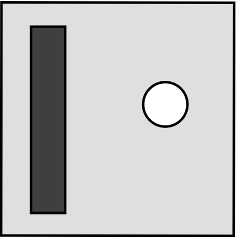

# 🏓 Pong Game

A simple Pong game built using [Pygame](https://www.pygame.org/). This is a classic 2D table tennis game where two players control paddles to bounce the ball back and forth. First player to reach the score limit wins.



## 🎮 Features

* Local multiplayer (2 players)
* Sound effects
* Score

## 🛠 Requirements

* Python 3.7+
* Pygame >= 2.0

Install dependencies:

```bash
pip install -r requirements.txt
```

## 🚀 Running the Game

```bash
python pong.py
```

## 🧰 Controls

| Player | Up      | Down      |
| ------ | ------- | --------- |
| Left   | `W`     | `S`       |
| Right  | `UP ⬆️` | `DOWN ⬇️` |

Press `ESC` to quit the game.

## 📁 File Structure

TBD

## 🧪 TODOs / Ideas

[ ] Add power-ups (e.g. speed boost, shrink paddle)
[ ] Gamepad support

## 📄 License

UNLICENSED
